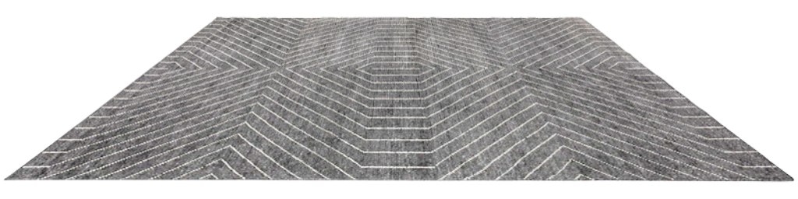

# Sala Virtual
El desarrollo presenta una sala virtual donde se pueden arrastrar determinados onjetos para ser representados en la escena. Es posible mover cada uno de los objetos, ser intercambiados por algunas opciones ya preestablecidas, mostrar información adicional de cada objeto al hacer click, acercar o alejar la escena para una mejor visualización, cambiar de color los fondos independientes y descargar una captura de la escena realizada hasta el momento.


## Modo de Uso
### Estructura básica del HTML del ítem
Cada uno de los objetos que se requiere sean arrastrados deben cumplir con la siguiente estructura.

```html

```
Atributos necesarios:
- **src**: URL relativa o absoluta de la imagen que mostrará el objeto HTML y la que se verá arrastrada
- **draggable**: Establece si el objeto puede ser arrastrado, debe estar como **true**.
- **id**: Id único para cada producto, el cual será utilizado para acceder al mismo.
- **data-size**: Establece la altura relativa a otros objetos en la escena.
- **data-url1**: Establece la URL de la imagen que se mostrará en la escena como primera opción.(Esta es la imagen que se mostrará por default)
- **data-url2**: Establece la URL de la imagen que se mostrará en la escena como segunda opción.(Si se deja vacío no se mostrará la opción)
- **data-url3**: Establece la URL de la imagen que se mostrará en la escena como tercera opción.(Si se deja vacío no se mostrará la opción)
- **data-url4**: Establece la URL de la imagen que se mostrará en la escena como cuarta opción.(Si se deja vacío no se mostrará la opción)
- **data-url5**: Establece la URL de la imagen que se mostrará en la escena como quinta opción.(Si se deja vacío no se mostrará la opción)
- **data-name**: Nombre del objeto que se mostrará en la interfaz.
- **data-price**: Precio del objeto.
- **data-mesures**: Medidas del objeto.
- **ondragstart**: Función que se llamará al ser arrastrado, debe ser **drag(event)**.

### Estructura básica del HTML del contenedor
```html
<div id="container" ondrop="drop(event)" ondragover="allowDrop(event)" style="height: 800px;">
</div>
<script>
  var cont = document.getElementById("container");
  ancho = cont.offsetWidth;
  alto = cont.offsetHeight;
</script>
```
- **div.id**: Id del contenedor del canvas, debe ser **container**.
- **div.ondrop**: Función llamada cuando se suelta un objeto sobre él, debe ser **drop(event)**.
- **div.ondragover**: Función llamada cuando un elemento se arrastra sobre él, debe ser **allowDrop(event)**.
- **div.style.height**: Se establece una altura fija para el canvas.(El ancho se puede definir, pero es calculado automáticamente por default)
- **script**: Se obtiene las medidas del contenedor, el código puede situarce luego de la creación del contenedor o en el evento onload del HTML.

### Funciones globales
- **plus()**: Ejecuta la función de realizar zoom in en la escena, se puede incluir en el evento *onclick* de cualquier elemento HTML.
- **minus()**: Ejecuta la función de realizar zoom out en la escena, se puede incluir en el evento *onclick* de cualquier elemento HTML.
- **circle1()**: Al ser ejecutado, llama a la función click del elemento tipo input color con ID *UpColor*, se puede incluir en el evento *onclick* de cualquier elemento HTML(este elemento debe tener ID *circle1*).
- **circle2()**: Al ser ejecutado, llama a la función click del elemento tipo input color con ID *DownColor*, se puede incluir en el evento *onclick* de cualquier elemento HTML(este elemento debe tener ID *circle2*).
- **change1()**: Cambia el color del fondo superior de la escena, y cambia el *backgroundColor* del elemento con ID *circle1*, Se debe incluir en el evento *onchange* de un elemento HTML de tipo input color(este elemento debe tener ID *UpColor*).
- **change2()**: Cambia el color del fondo superior de la escena, y cambia el *backgroundColor* del elemento con ID *circle2*, Se debe incluir en el evento *onchange* de un elemento HTML de tipo input color(este elemento debe tener ID *DownColor*).

>**NOTA:** Tanto los objetos de ID *circle1* con *UpColor* y *circle2* con *DownColor*, debn ser posicionados de la misma manera, para tener un comportamiento óptimo.
